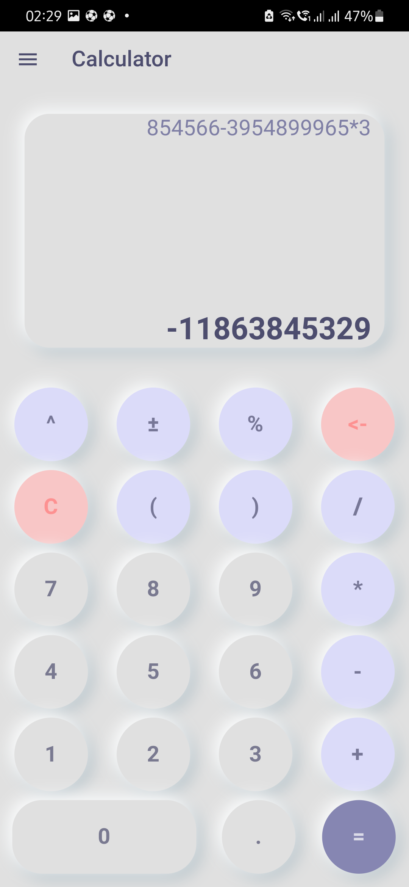
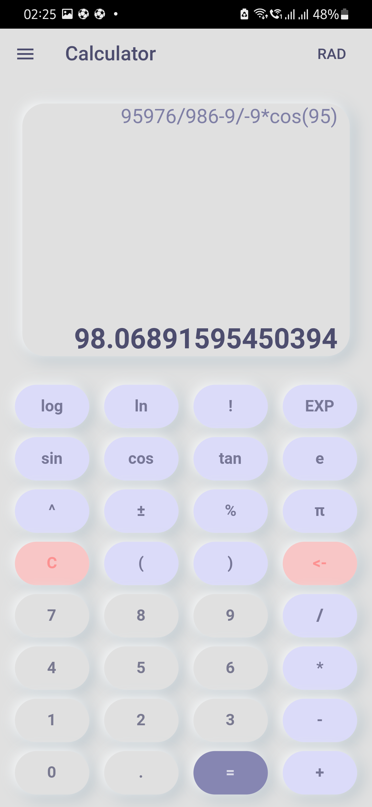
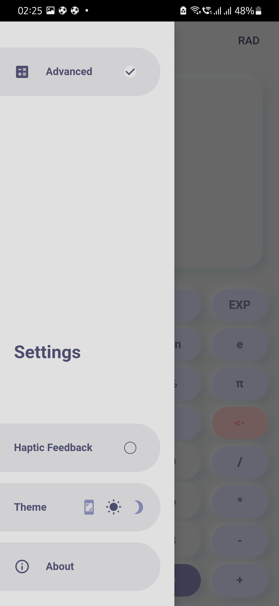
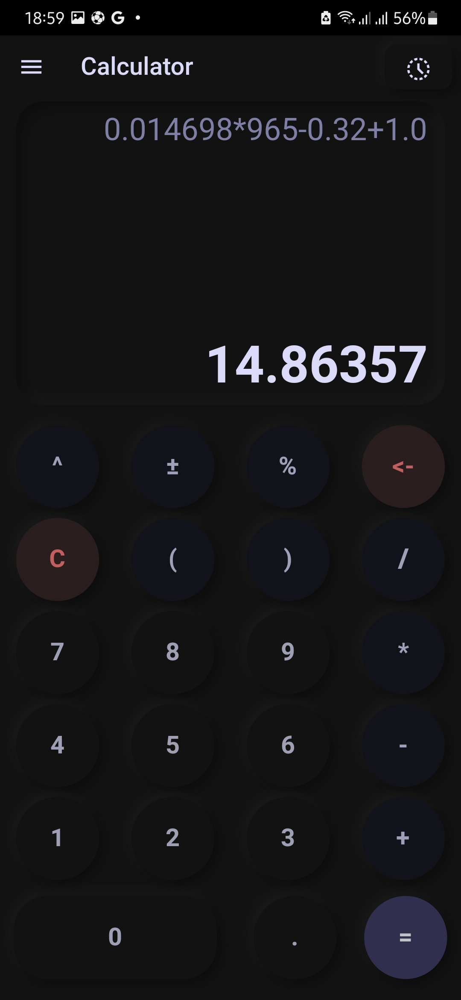
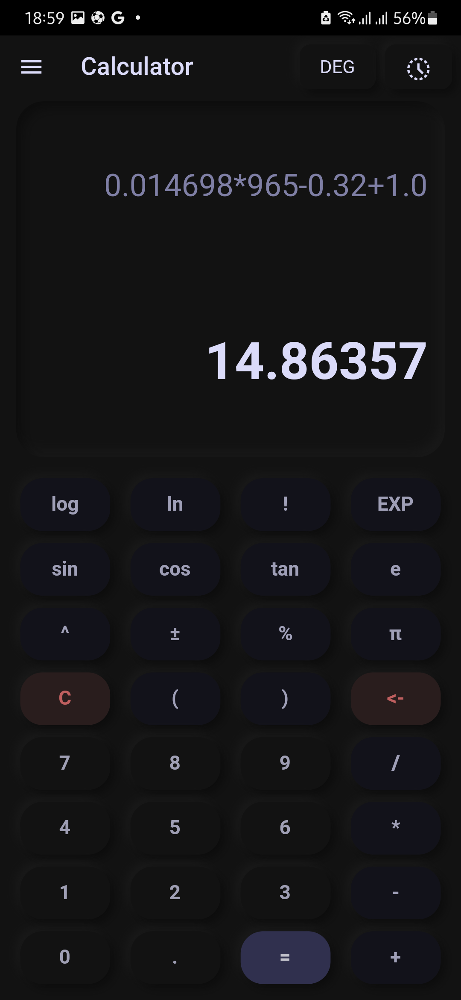

# Neumorphic Calculator

A Soft UI Calculator using Flutter.

## Modes:
- [x] Simple
- [x] Advanced (**Currently, only trigonometric functions with radians is stable.** Degree operations have been implemented using a *non-tested* [fork](https://github.com/danger-ahead/math-expressions/tree/add-degree-hack) of the official [math_expressions](https://github.com/fkleon/math-expressions) library.)

## Screenshots

### Light Mode
  &nbsp;&nbsp;

### Dark Mode
  &nbsp;&nbsp;

